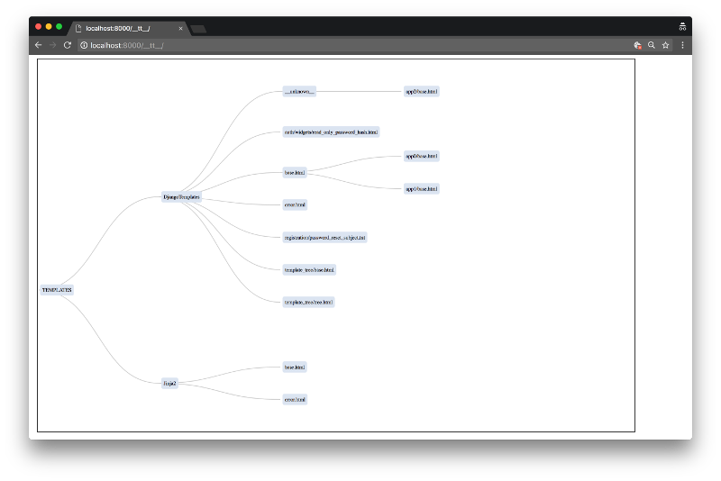
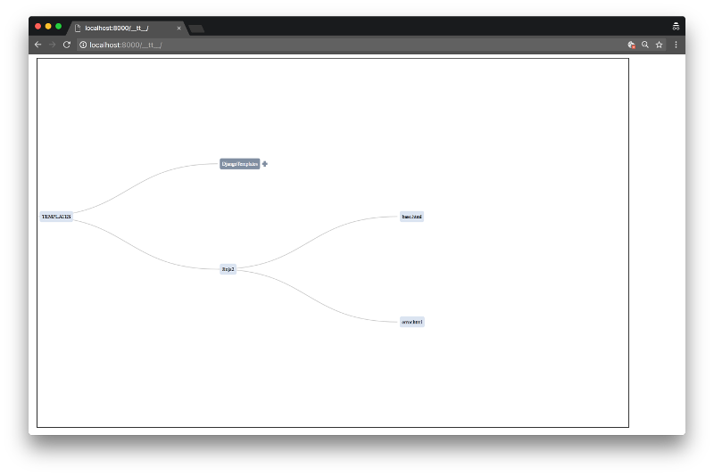

=====
Usage
=====

To use django-template_tree in a project, add it to your `INSTALLED_APPS`:

.. code-block:: python

    INSTALLED_APPS = (
        ...
        'template_tree',
        ...
    )

Add django-template_tree's URL patterns:

.. code-block:: python

    from template_tree import urls as django_template_tree_urls

    urlpatterns = [
        ...
        url(r'^__tt__/', include(django_template_tree_urls)),
        ...
    ]

Ideally, you should not enable this app in production, as it may reveal facts about your application
that you wish to keep secret.

Visiting the URL in a browser will show a template inheritance diagram like this one:

Nodes can be collapsed (by clicking), in order to improve clarity or illustrate a particular line
of inheritance.

